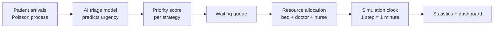

# 🏥 MedFlow — Prioritize Patients. Optimize Resources.

A Hospital Resource Management Simulator. Patients arrive with different levels of urgency, the hospital has limited beds, ICU beds, doctors and nurses, and MedFlow decides **who is treated next** while avoiding resource conflicts and reducing waiting time. Results are shown on a live operations dashboard.

> 🎥 **Demo video:** _(add your link here)_

---

## 🤖 AI Component (clearly stated)

**AI triage urgency classifier** (`ai_model.py`)

- **What it is:** a Random Forest classifier (scikit-learn).
- **Input:** a patient's vital signs: age, heart rate, systolic blood pressure, oxygen saturation (SpO2), respiratory rate and temperature.
- **Output:** a predicted urgency level from 1 (critical) to 5 (mild).
- **How it is trained:** on thousands of generated patients whose urgency labels come from danger-zone rules plus random noise. It trains on 80% of the data and is evaluated on the 20% it has never seen.
- **Measured performance:** about 68% exact-level accuracy and about 98% within one level of the true urgency (run `python ai_model.py` to reproduce).
- **How the AI drives the system:** for every arriving patient, `simulation.py` calls `model.predict()` and the scheduler ranks the queue using the **predicted** urgency. The hidden true urgency is only used to measure outcomes (waiting time per real urgency level, accuracy). The AI is not hardcoded and not faked: change the model and the scheduling changes.
- **Limitation (honest):** the training data is synthetic, not real hospital records. The code is structured so a real dataset can replace it inside `train_model()`.

---

## How it works



1. **Patient arrivals:** random arrivals whose rate changes across the day (busier around midday), with an optional surge.
2. **Priority calculation:** the AI predicts urgency; a scoring strategy turns it into a priority.
3. **Resource allocation:** a patient is treated only if *every* resource they need (bed or ICU bed, a doctor and a nurse) is free at the same moment. Capacity is never exceeded, so there are no resource conflicts.
4. **Scheduling simulation:** each simulated minute the system admits arrivals, discharges finished patients, re-ranks the queue and allocates resources.
5. **Performance statistics:** waiting times, utilization, queue length and SLA breaches.

### Scheduling strategies (all compared on the same patients)

| Strategy | Score |
|---|---|
| FCFS | earlier arrival = higher priority |
| Urgency only | `(6 - predicted urgency) × 10` |
| Urgency + waiting time | `(6 - predicted urgency) × 10 + w × minutes waited` |

The waiting-time term `w` stops low-urgency patients from waiting forever (starvation).

### Bonus features included

- Emergency patient surge
- Staff shortage
- ICU capacity constraints
- Unexpected resource (equipment) failure
- Comparison of scheduling strategies, including urgency-only vs urgency + waiting time and resource utilization

### Model check

Average queue length equals arrival rate × average wait (Little's Law). The dashboard shows both numbers so you can see the bookkeeping is consistent.

---

## Run it

Requires Python 3.9+.

```bash
git clone https://github.com/<your-username>/medflow.git
cd medflow
pip install -r requirements.txt
streamlit run app.py
```

Quick tests without the dashboard:

```bash
python ai_model.py       # trains the AI model and prints its accuracy
python simulation.py     # compares the three strategies in the terminal
```

## Project structure

```
medflow/
├── app.py           # Streamlit operations dashboard
├── simulation.py    # arrivals, priority scoring, allocation, statistics
├── ai_model.py      # AI triage classifier (training + prediction data)
├── requirements.txt
└── README.md
```

## Example results

Default settings (5 doctors, 7 nurses, 8 beds, 2 ICU beds, seed 1). Yours may differ slightly; re-run and update this table with your own numbers.

| Strategy | Avg wait | 95th pct wait | Critical patients wait | Mildest patients wait | Starved (>4h) |
|---|---|---|---|---|---|
| FCFS | 20.0 min | 60.0 min | 0.0 min | 19.6 min | 0 |
| Urgency only | 28.0 min | 247.5 min | 0.3 min | 86.4 min | 10 |
| Urgency + waiting time | 24.3 min | 109.0 min | 1.0 min | 47.5 min | 0 |

Urgency-only serves critical patients fastest but lets mild cases wait for hours. Adding waiting time removes the starvation at a small cost. Try turning on the surge and staff shortage events to see the gap grow.

## Tools and libraries used

Python, Streamlit (dashboard), scikit-learn (Random Forest), NumPy, pandas.

## Team

_(add names and roles)_
